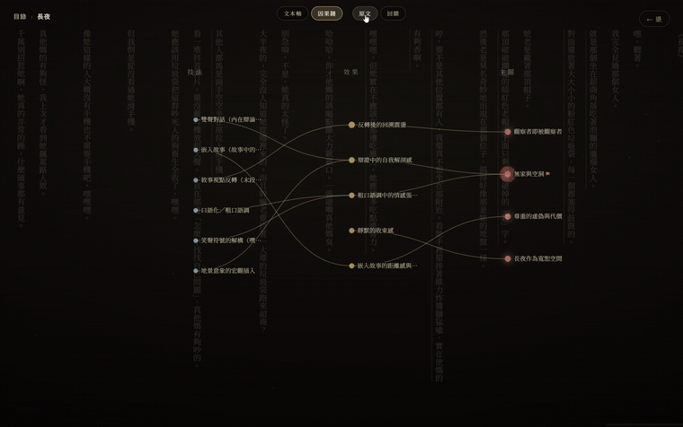
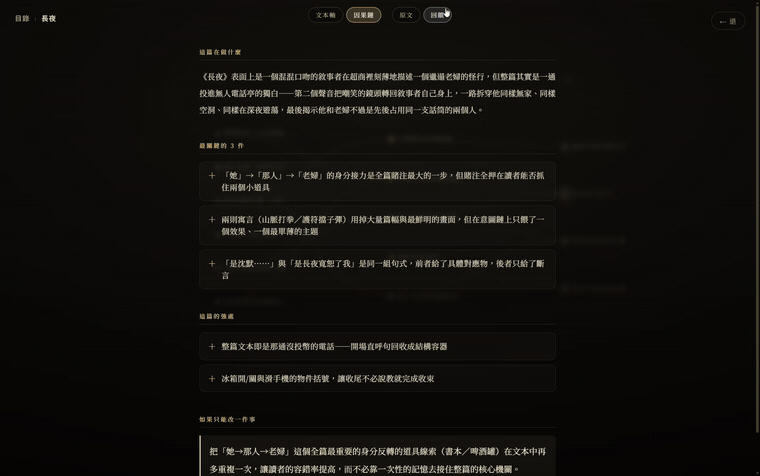

<div align="center">


<br>


[繁體中文](README.md) · **English**

</div>

> A **critique & thinking tool** for literary short fiction, running on [Claude Code](https://claude.com/claude-code) — **on your subscription, not API tokens**.

## What it is · Who it's for

For people who **write literary short fiction in Chinese / Taiwanese (< 10k characters)**.

It isn't a paste-and-get-a-review one-shot. It's a personal thinking partner that **analyzes, gives developmental feedback, discusses back and forth, and visualizes** the analysis — helping you read one piece to the bottom. When a story comes in, two **deliberately isolated** AIs split the work: one only **observes** (extracting themes / motifs / techniques / effects / characters / beats, each pinned to verbatim quotes), the other only **judges** (a developmental-editor persona giving weighted, sycophancy-free feedback). Observation and judgment stay apart — that's what keeps the judgment independent.

## A look at the interface

You arrive in a starfield where each story is a **data-driven star-bone** (spine = tension curve, ribs = themes and motifs). Dive into one and you land on its three views.

<div align="center">

</div>

| Intention chain | Text-axis anatomy | Developmental feedback |
|:---:|:---:|:---:|
|  |  |  |
| technique → effect → theme: see exactly what recoil each move produces | tension curve + motif recurrence + technique/effect marks, laid out along the text | editor overview, the few things that matter most, strengths, the one change to make — each anchored to the source |

▶ **[Watch the full journey (enter → pick → dive → dissect)](assets/demo.gif)**

## Why it's different

| Dimension | hyenovel | A typical "paste into an AI" review |
|---|---|---|
| **Observe vs. judge** | two isolated subagents: observe first, judge second — judgment stays independent | one model writes it all at once; observation is polluted by judgment |
| **Citations** | every claim is **pinned to a verbatim quote**; a hard gate verifies it against the source and blocks hallucinated quotes | often riffs from impression, hard to trace back |
| **Billing** | runs on Claude Code, **on your subscription** — not metered per token | metered per API token; the more you talk, the more it costs |
| **Privacy** | **localhost, single-user** only; your writing never leaves your machine | content uploaded to a third-party cloud |
| **Visualization** | intention chain (technique→effect→theme) + text-axis tension curve | plain bulleted text |
| **Interaction** | **discuss** a piece back and forth — opinionated, anti-sycophancy, asks back | one-shot, tends toward flattering summaries |

## Install

**Prerequisites**

- [Claude Code](https://claude.com/claude-code) installed and signed in — this tool uses your subscription, not API billing.
- Python 3, Node.js.

**Steps**

```bash
git clone https://github.com/randyxu0711/hyenovel.git
cd hyenovel

# Backend (Python)
python3 -m venv server/.venv
server/.venv/bin/pip install -r server/requirements.txt

# Frontend (Node); dev.sh also auto-installs on first run
cd web && npm install && cd ..
```

## Run & use

### Web app (recommended)

```bash
./dev.sh          # starts front + back together, Ctrl+C stops both
```

Open http://localhost:5173 — dive into a story, view the intention chain / text axis, read the editor feedback, or discuss it right there.

> localhost, single-user only; subscription auth is bound to local credentials — **do not deploy to the cloud**.

### Command line (in a Claude Code session opened in the repo dir)

1. Put a story at `stories/<slug>/source.md`.
2. `/story-critique stories/<slug>/source.md` — run the full critique chain, producing analysis + feedback.
3. `python viz.py <slug>` — build `viz.html` (open in a browser): intention chain + text-axis anatomy.
4. `/story-discuss <slug>` — discuss the piece back and forth (grounded, sycophancy-free).

## How it works

```
stories/<slug>/source.md ──analyst (subagent)──▶ analysis.json   observation of record
                                                      │
analysis.json + source.md ──criticizer (subagent)──▶ feedback.json  judgment of record
                                                      │
                     ┌────────────────┬────────────────┘
                     ▼                ▼
        analysis.md / feedback.md (for humans)     viz.py ─▶ viz.html
```

The observer and the judge are **two subagents with separate contexts** — never the same context — so judgment independence isn't polluted. Their outputs feed the visualization, drawing out the technique → effect → theme intention chain and the text tension curve. **Every claim must match the source verbatim** (a hard gate that blocks hallucinated quotes).

> For the internal contracts and design: `schemas/analysis.schema.json`, `docs/DESIGN.md`.

---

<div align="center">


<sub>Story content (<code>stories/</code>) is the user's own writing and is not committed; this repo contains only code and tooling.</sub>
</div>
