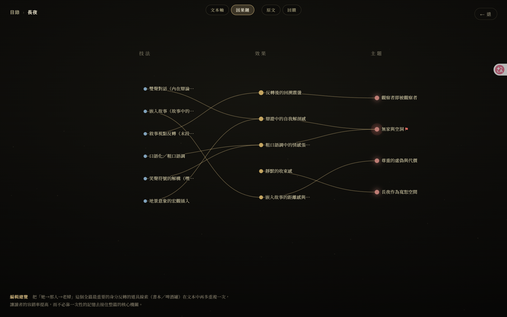
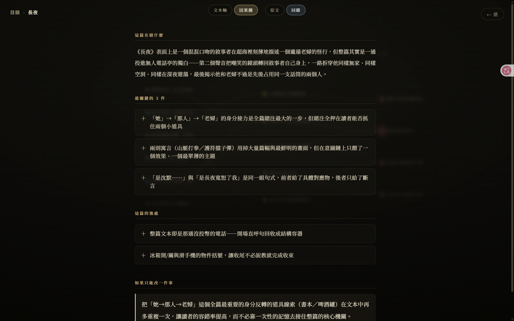

# hyenovel

純文學短篇的**評論 / 思考討論工具**,跑在 Claude Code(吃訂閱、不用 API token)。
不是一次性產一份報告,而是**會分析、給發展性回饋、能來回討論、把分析視覺化**的個人思考工具——
你寫中文 / 台語白話的純文學短篇(< 1 萬字),它陪你把一篇讀透、讀出所以然。


## 介面一覽

**目錄** — 每篇短篇是一顆繞行的星,骨架即它的分析輪廓;進一篇才潛入深處。


**意圖鏈** — 技法 → 效果 → 主題,一眼揪出孤兒技法 / 過載主題 / 空心主題。


**文本軸解剖** — 張力曲線 + 意象復現;點任一節點跳回原文逐字。


**發展性回饋** — 出版編輯人格,有輕重、不諂媚,每條意見都掛著原文。


## 安裝

**前置**
- [Claude Code](https://claude.com/claude-code) 已安裝並登入——本工具吃訂閱、不走 API 計費。
- Python 3、Node.js。

**步驟**
```bash
git clone https://github.com/randyxu0711/hyenovel.git
cd hyenovel

# 後端(Python)
python3 -m venv server/.venv
server/.venv/bin/pip install -r server/requirements.txt

# 前端(Node);dev.sh 首次啟動也會自動補跑
cd web && npm install && cd ..
```

## 啟動與使用

### Web app(推薦)
```bash
./dev.sh          # 一鍵起前後端,Ctrl+C 一起收
```
開 http://localhost:5173 ——挑一篇故事潛入,看意圖鏈 / 文本軸,讀編輯回饋,或就地來回討論。

> 只跑 localhost、單人使用;訂閱認證綁本機憑證,**別部署到雲端**。

### 命令列(在 repo 目錄開的 Claude Code session)
1. 把故事放成 `stories/<slug>/source.md`。
2. `/story-critique stories/<slug>/source.md` — 跑完整評論鏈,產出分析 + 回饋。
3. `python viz.py <slug>` — 出 `viz.html`(瀏覽器開):意圖鏈 + 文本軸解剖。
4. `/story-discuss <slug>` — 就這篇來回討論(有據、不諂媚)。

## 運作原理(一眼)

一篇故事進來,兩個**隔離**的 AI 分工:一個只**觀察**(拆出主題 / 意象 / 技法 / 效果 / 角色 / 節拍,每條掛逐字原文),
另一個只**判斷**(出版編輯人格,給有輕重、不諂媚的發展性回饋)。觀察與判斷分開,判斷才獨立。
兩者的產物再餵給視覺化,把「技法 → 效果 → 主題」的意圖鏈與文本張力曲線畫出來。**每條主張都必須逐字對得上原文**(硬閘門,擋幻覺引用)。

> 想看內部契約與設計:`schemas/analysis.schema.json`、`docs/DESIGN.md`。

---

*故事內容(`stories/`)是使用者創作,不進版控;本 repo 只含程式碼與工具。*
